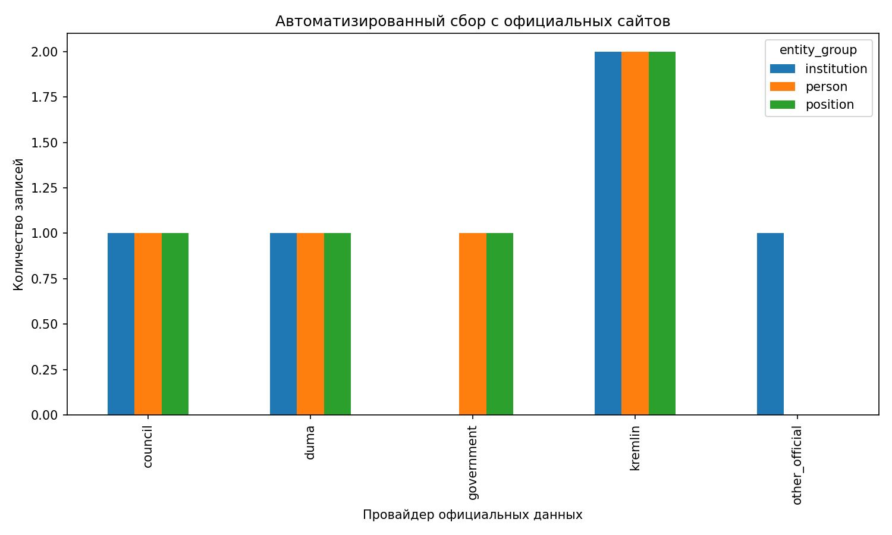
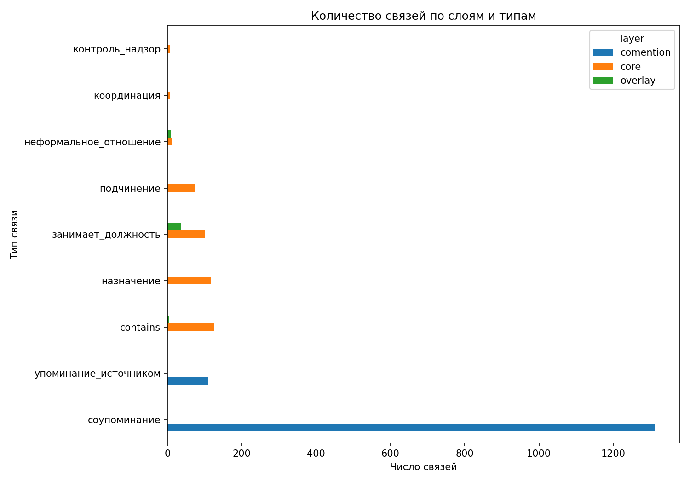
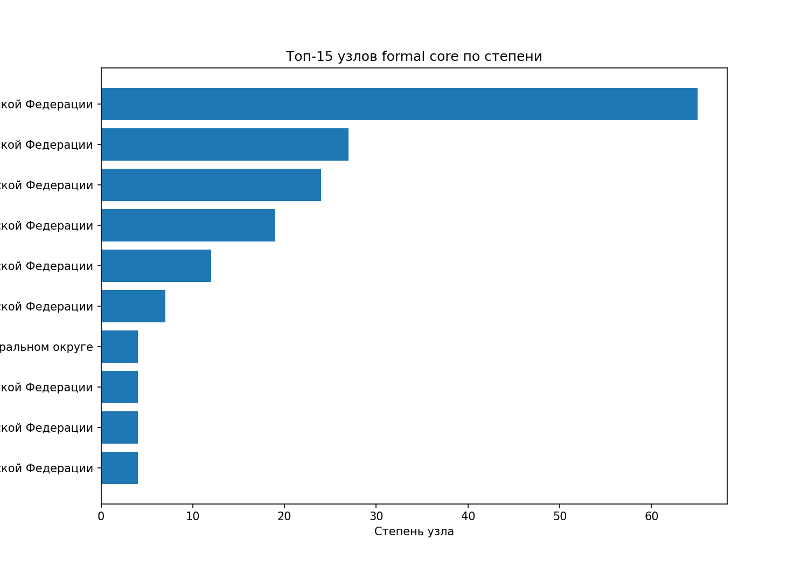
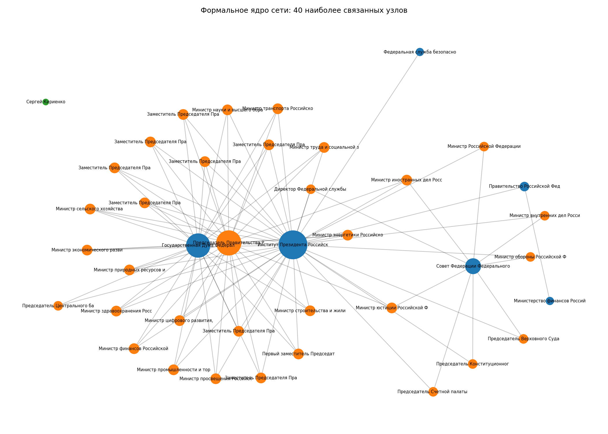

## Исследовательский вопрос

**Насколько формальная структура российской власти совпадает с сетевой структурой кадровых, координационных и аналитически реконструируемых связей?**

## Корпус данных

В проекте используются четыре слоя данных:

- **official** — формальный институциональный слой, собранный кодом с официальных сайтов;
- **core** — формальный институциональный каркас исследовательской базы;
- **overlay** — аналитический слой на основе политологических исследований;
- **comention** — слой соупоминаний, позволяющий оценить дополнительную связанность акторов.

Исходные Kumu-таблицы в проекте не являются финальным инструментом анализа. Они используются как сырой источник, после чего обрабатываются собственным Python-кодом.

## Методика

### Автоматизированный сбор официальных данных

Проект включает модуль `src/scrape_official.py`, который пытается автоматически собрать формальный институциональный слой с официальных страниц:

- Кремль;
- Правительство РФ;
- Государственная Дума;
- Совет Федерации.

Для воспроизводимости в офлайн-среде в репозиторий включён кэшированный snapshot официального слоя. Это позволяет показать отдельный этап **автоматизированного сбора данных**, а не только ручную разметку.

### Использованные DH-методы

1. **Сетевой анализ**:
   - degree centrality,
   - betweenness centrality,
   - closeness centrality,
   - анализ типов связей и плотности слоев.

2. **Сравнительный анализ многослойной сети**:
   - сопоставление `official`, `core`, `overlay`, `comention`,
   - сравнение типов связей,
   - различие формального и аналитического каркаса.

## Визуализации

### Автоматизированный сбор с официальных сайтов

Диаграмма показывает, что в проект включен отдельный кодовый этап сбора формального институционального слоя с официальных сайтов. В офлайн-версии используется кэшированный snapshot, но формат данных и пайплайн остаются воспроизводимыми.

### Типы связей по слоям

Эта диаграмма показывает, что разные слои данных фиксируют разные типы отношений. `core` отражает институциональный каркас, `overlay` — исследовательскую аналитическую надстройку, а `comention` — плотность совместной видимости акторов в корпусе сообщений.

### Центральные узлы formal core

Диаграмма показывает, какие узлы занимают центральное место в формальном каркасе. Это не тождественно «реальной власти», но позволяет увидеть опорные точки сети.

### Подграф formal core

На графе видны наиболее связанные узлы формального ядра. В дальнейшем это можно сопоставить с аналитическим слоем и проверить, где формальная сеть совпадает с реконструированной сетью влияния, а где расходится.

## Ограничения

- Формальный институциональный слой собран с официальных сайтов, но весь исследовательский граф не является purely official.
- Слои `overlay` и `comention` не являются полностью verified-only.
- Значение центральности зависит от того, какие типы ребер включены в formal core.
- Часть исходного корпуса была первоначально структурирована в Kumu, но финальный анализ выполнен собственным Python-кодом.

## Вывод

Проект показывает, что исходно визуализационный Kumu-корпус можно превратить в воспроизводимый Python-пайплайн, который включает автоматизированный сбор официальных данных, предобработку, сетевой анализ и кодовые визуализации.
